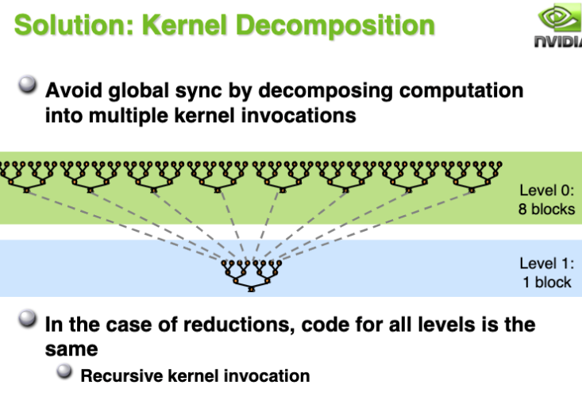

## mp04课程notes

### 1. Cuda has no global synchronization between thread blocks
Because:

 - Expensive to build in hardwares for GPUs with high processor count
 - would force programmer to run fewer blocks(no more than `#Multiprocessors * #Resident Blocks/Multiprocessor` to avoid deadlocks)

### 2. Kernel decomposition for parallel reduction
To sync parallel reduction between thread blocks, we decompose kernels.

### 3. Metric for optimization

 - GFLOPS/s: For compute-bound kernels
 - Bandwidth: For memory-bound kernels

### 4. Bank Conflict
`Important: Bank conflicts are only an important consideration on the warp level, threads in different blocks do not cause bank conflicts with each other. `

***Here is a fantastic tutorial about bank conflit [on Youtube](https://www.youtube.com/watch?v=CZgM3DEBplE). You can also try [demo code](../tools/bank_conflict.cu) to test effect of bank conflict.***

#### 4.1 What is bank
The 64k(of shared/L1 memory per SM) is broken into 4 byte sections called Words, Any word could be 32 bit int, a float, 2 shorts, half a double etc.

**There are 32 banks**, Each successive word of successive word of shared memory blongs to another bank. Word[0] belongs to bank 0, Word[1] belongs to bank 1 etc. all the way up to Word[31] which belongs to bank 31. Then the banks start again so Word[32] is the second word of bank 0, Word[33] blongs to bank 1 etc. Shared memory always reads entire words. If you ask for single byte, it's going to read the entire 4 byte belongs to. If you ask for a misaligned word(whose lower and upper belongs to different banks), then two bank requests must be made.

#### 4.2 What is bank conflict
The addresses that a warp requests can reference any permutation of the 32 banks whatsoever. Shared meory performs fastest when there is one request from each bank per warp and a `bank conflict` occurs when threads of a warp request `different values from the same bank` in a single request. Here's also two special case:
 - Broadcast: If the threads of a warp all request `exactly the same value`, you'll get a `broadcast`. The value will be read once from the shared memory and broadcast to the threads.
 - Multicast: If several threads `request the same value` from a particular bank, you will get a `multicast`. This is a smaller version of `broadcast`. The value will be read once from shared memory.

 #### 4.3 The effect of bank conflict

 

